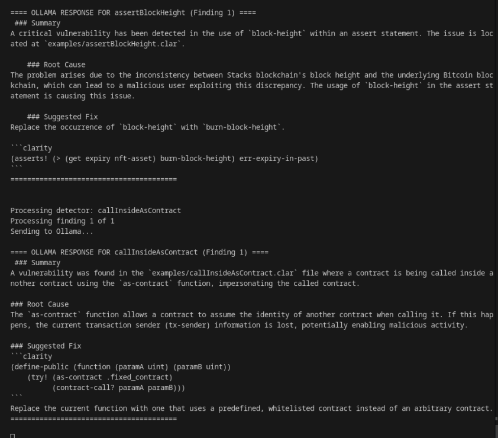

# Yarara App: Eating your bugs one at a time 

> [!Warning]
> The Yarara App is currently in an experimental state.

_Yarara_ is a Clarity Toolsuite for securing your contracts. It leverages our ClarityQL tool for static analysis and our custom Clarity Fuzzer, runs these tools on your project, and interprets the findings using an AI assistant to provide feedback, explain the findings and suggest fixes for you.

## Setup and run
To setup for running locally, you must run:
```bash
cd yarara-dashboard-bff
npm install
npm start
```
Then, in a separate terminal, run:
```bash
cd yarara-dashboard-fe
npm install
npm run -dev
```

The dashboard will be in `http://localhost:3000/dashboard`.

Once setup and running, you may use your Github account to log in. Then select a repository that has Clarity contracts inside, and start your analysis!

## AI Assistant (experimental)
We are using ollama to integrate an LLM as an assistant and aggregator: the output of both CodeQL and the fuzzer are different and may not be easy to interpret, so we use `Mistral 7B` as our LLM of choice to help the user in understanding and leveraging the output of the tools. We are still crafting our prompts for the fuzzer, but here is an example of the CodeQL prompt:

```md 
You are a security code analysis assistant. When given CodeQL findings, your job is to provide a concise, direct analysis.

I'll provide:
- CodeQL output
- The file where the finding was detected
- The description of the query (what it's searching for)
- Additional documentation about the vulnerability

You must respond with ONLY:
1. A brief summary (2-3 sentences) of the issue and its location
2. A concise explanation (3-5 sentences) of why this issue occurred
3. A suggested code fix

Format your response using this exact structure:
### Summary
[Your concise summary of what happened and where]

### Root Cause
[Your focused explanation of why it happened]

### Suggested Fix
\`\`\`
[code]
// Your suggested fixed code snippet
\`\`\`
Do not include introductions, conclusions, or any text outside these three sections. Be technical but clear. For the fix, provide only the relevant snippet, not the entire file.
``` 

Here is an example of the kind of output the AI assistant produces:


We have a server that takes the output of CodeQL and the fuzzer in `/codeql` and `/fuzzing` respectively, runs it through `Mistral` and relays the output to the frontend. 

## Upcoming features
- A model selector, alongside benchmarks for each supported model
- AI assisted custom query creation for ClarityQL
- AI assisted custom property check creation for ClarityFuzzer
- AI feedback loop to refine queries
- Use CodeQL queries in conjunction with AI to guide fuzzing campaign dynamically